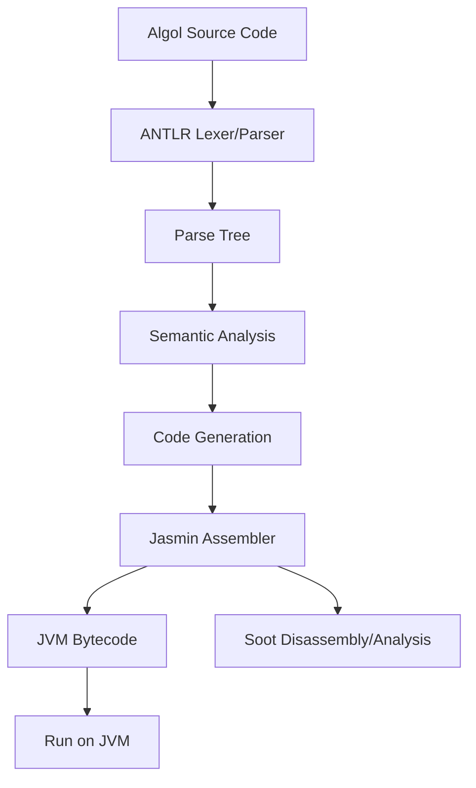
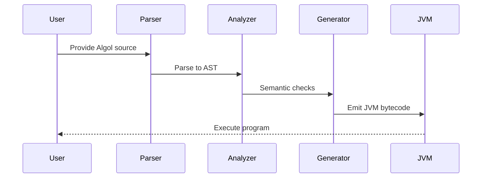

# Project Architecture

This document describes the high-level architecture of the Algol-to-JVM compiler project.

## Overview

The project consists of several main components:
- **Frontend (Parser & Lexer):** Parses Algol source code using ANTLR grammar.
- **Semantic Analysis:** Builds symbol tables, checks types, and validates scope.
- **Code Generation:** Translates parsed Algol code into JVM bytecode using Jasmin.
- **Testing & Samples:** Includes sample Algol programs and JUnit tests for validation.
- **Supporting Tools:** Uses Soot for bytecode analysis/disassembly and Java CUP for alternative parsing.

## Component Diagram

## Data Flow

## Directory Structure

- `src/main/java/` - Java source code
- `src/main/antlr/` - ANTLR grammar files
- `src/test/java/` - Unit tests
- `test/algol/` - Sample Algol programs used for testing
- `lib/` - Third-party libraries (Jasmin; ANTLR and Soot managed via Gradle)
- `docs/` - Documentation

## Future Extensions

- Support for more Algol features
- Improved error handling and diagnostics
- IDE integration (syntax highlighting, auto-completion)
- More advanced optimizations and analysis

---

_Last updated: February 28, 2026_
