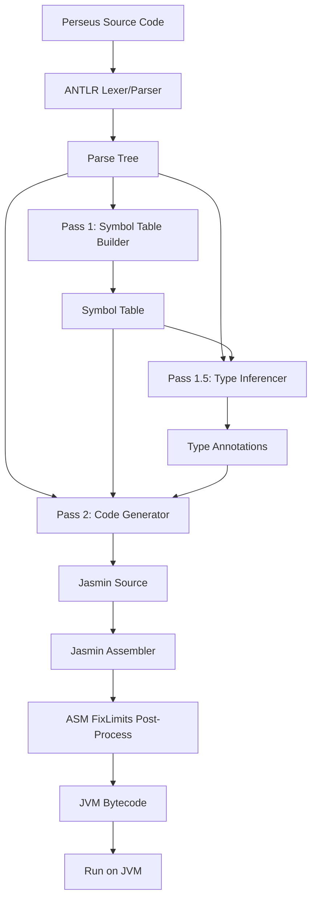
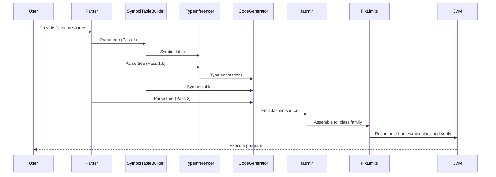
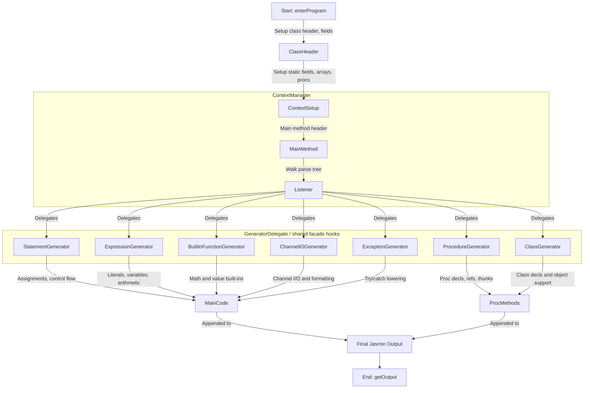

# Project Architecture

This document describes the high-level architecture of Perseus, an Algol-derived language and compiler platform targeting the JVM.

## Overview

The project consists of several main components:
- **Frontend (Parser & Lexer):** Parses Perseus source code using an ANTLR grammar rooted in the project's Algol heritage.
- **Pass 1 — Symbol Table Construction:** Walks the parse tree to collect variable names, types, and block scope nesting. Required before code generation because Jasmin needs `.limit locals N` declared before method body instructions, and forward `goto` labels must be known before jumps are emitted.
- **Pass 1.5 — Type Inference:** Walks the parse tree after symbol table construction to annotate every expression node with its resolved type (`integer`, `real`, `boolean`, `string`, or `procedure:T`). Required because `CodeGenerator` must select different JVM instructions depending on expression type (e.g. `iadd` vs `dadd`), and those types must be fully resolved before any code is emitted.
- **Pass 2 — Code Generation:** Walks the parse tree a third time, using both the symbol table from Pass 1 and the type annotations from Pass 1.5, to emit Jasmin assembly instructions.
- **Assembly:** Jasmin assembles the generated `.j` family into JVM `.class` files.
- **Post-Assembly Verification and Cleanup:** After assembly, Perseus runs `FixLimits` over the generated class family to recompute frames/max stack values and catch verifier problems across the main class and its companions.
- **Testing & Samples:** Includes sample programs and JUnit tests for validation.

## Development Approach

Perseus was not built by transliterating the full ALGOL reports directly into a finished ANTLR grammar in one step. In practice, that approach ran into the usual grammar-conversion problems, including left-recursion issues and hard-to-diagnose parse failures.

The project instead evolved iteratively:

- Start from small working programs
- Add the minimum grammar and code generation needed for each feature
- Expand coverage through tests and historically meaningful sample programs

That incremental approach remains part of the architecture story, because it explains why the grammar, tests, and implementation are so tightly coupled. Perseus grows by validating concrete language behavior, not just by broadening grammar coverage in the abstract.

## Tooling Choices

### ANTLR

ANTLR was chosen because Perseus is implemented in Java and benefits from a parser generator with strong Java integration, good documentation, and a practical developer experience. Other parser generators were considered, including CUP, but ANTLR fit the project better as the grammar evolved.

ANTLR also works well with the incremental development strategy above: the grammar can be extended feature by feature while keeping parsing, tests, and compiler passes aligned.

Perseus did not try to reproduce a standard Algol BNF exactly and then force that grammar wholesale into ANTLR. The report BNF is illustrative rather than a drop-in implementation grammar, and the Algol standards themselves leave room for compiler-specific, hardware-specific representations. Instead, the Perseus grammar was developed incrementally through test-driven work: start from small working programs, add the minimum syntax needed for the next feature, and refine the grammar as historically meaningful samples and compiler behavior demanded it.

That combination of standard flexibility and incremental development has resulted in a grammar that is intentionally unique to Perseus: rooted in Algol tradition, but shaped by the project's own representation choices, compatibility decisions, and practical compiler-testing needs.

### Jasmin

Perseus uses **Jasmin** for JVM bytecode assembly. The project keeps `jasmin-2.4/jasmin.jar` bundled locally and references it directly from Gradle. This keeps the bytecode emission path explicit and stable, which is especially useful in a compiler that intentionally exposes and inspects its generated assembly.

Jasmin 3.x exists as a Maven artifact, but it is based on an older Jasmin lineage and is not the version used here.

Perseus has also considered alternatives to Jasmin for JVM assembly, but Jasmin remains the primary assembler because it is stable, well-understood, and straightforward to inspect while debugging generated bytecode. Newer assemblers may offer conveniences in some areas, but they are less familiar and would add migration risk without a compelling advantage at the current stage of the project.

### ASM

Perseus uses **ASM** as a standard post-assembly step after Jasmin has emitted the `.class` family. The `FixLimits` pass recomputes frames and max-stack values, and verifies the generated bytecode across the main class and its companion classes.

This keeps the code generator simpler and more conservative: Perseus can emit safe fixed limits in Jasmin, then let ASM normalize and verify the finished class files. That approach has proved especially valuable for advanced features such as nested procedures, thunks, procedure references, and other cases where verifier problems may only appear in generated companion classes rather than the main program class.

## Component Diagram



## Data Flow



## Why the Compiler Uses Multiple Passes

Perseus uses a deliberately staged front end rather than trying to resolve names,
types, and bytecode emission in a single parse-tree walk.

### `SymbolTableBuilder`

The first pass collects declarations, scopes, labels, procedure signatures, and
other metadata that later stages need before code generation can begin.

This is necessary because:

- Jasmin needs `.limit locals N` before method-body instructions are emitted.
- Forward `goto` targets must be known before jumps are emitted.
- Nested procedures are lowered to separate JVM methods, so their signatures must
  be known before call sites are generated.

### `TypeInferencer`

The type-inference pass runs after symbol discovery and before code generation.
It annotates expression nodes with resolved types such as `integer`, `real`,
`boolean`, `string`, and procedure/reference forms.

Perseus keeps this as a separate pass because `CodeGenerator` must choose
different JVM instructions based on resolved types, for example:

- `iadd` vs `dadd`
- integer vs real comparisons
- widening and narrowing conversions in assignments
- array element load/store instructions by element type

Separating this logic keeps code generation focused on lowering already-resolved
semantics rather than re-deriving types while emitting bytecode.

Structured exception handlers also use this pass to type any `when ... as ex do ...`
binding as an object reference to the resolved Java exception class, so member
calls such as `ex.getMessage()` can be validated before code generation.

### Why Not Merge the Passes?

The separate-pass design keeps concerns clean:

- `SymbolTableBuilder` answers what names exist and where.
- `TypeInferencer` answers what expressions mean.
- `CodeGenerator` answers how those resolved constructs lower to JVM bytecode.

That separation has made it easier to grow the compiler incrementally, add new
language features, and improve diagnostics without entangling analysis and
emission logic in one listener.

For future Java-class and Java-interface inheritance, the same staged design suggests a clear validation point: after `SymbolTableBuilder` has collected class metadata and external type names, and before `CodeGenerator` emits bytecode. That is the right stage to verify that a Perseus class actually matches the Java superclass or interface it claims to extend or implement, including required methods, constructor chaining rules, and abstract-method obligations. JVM and ASM verification should remain a safety net, not the first place users discover those mistakes.

## Output Class Files

The compiler produces one or more `.class` files per source file:

- **`Hello.class`** — the main compiled class (always produced)
- **`Hello$Thunk0.class`, `Hello$Thunk1.class`, …** — synthetic thunk classes, one per call-by-name argument at each call site that uses a procedure with name-parameters
- **`Hello$ProcRef0.class`, `Hello$ProcRef1.class`, …** — synthetic procedure reference classes that lift a static method to an object implementing the appropriate procedure interface (`VoidProcedure`, `RealProcedure`, `IntegerProcedure`, or `StringProcedure`). One is generated per distinct procedure variable assignment or procedure-typed argument.

If the program needs call-by-name thunks or procedure references, `compileToFile()` also emits support Jasmin sources alongside the main program:

- `Thunk.j` is emitted when generated thunk classes are needed.
- `ProcedureInterfaces.j` is emitted when generated procedure-reference classes are needed.

- **`VoidProcedure.class`**, **`RealProcedure.class`**, **`IntegerProcedure.class`**, **`StringProcedure.class`** — interface classes assembled from `ProcedureInterfaces.j` and used as the type of procedure variables and procedure parameters. All `$ProcRef` classes implement one of these interfaces.
- **`Thunk.class`** — the interface class assembled from `Thunk.j` and used by call-by-name thunk objects (`get()` / `sync()` / `set()`).

In current builds, those support classes are emitted as Jasmin when needed (`Thunk.j` and `ProcedureInterfaces.j`) and assembled together with the main program and every `Main$*.j` companion. The emitted `Thunk` interface now includes `get()`, `sync()`, and `set()`, where `sync()` lets recursive procedure-identifier thunks refresh their captured bridged environment before re-entrant reuse.

This follows the same convention as `javac`, which emits `Foo$Inner.class` for inner classes and `Foo$1.class` for anonymous classes. Users run the program the same way regardless: `java -cp . Hello`. No JAR packaging is required.

---

## Array Model on the JVM

Perseus arrays are intentionally not Java arrays in the language-design sense, even though they are implemented on top of JVM array bytecodes.

### How Perseus differs from Java

- Perseus declarations use explicit bounds such as `real array q[-7:2];`, whereas Java uses lengths such as `double[] q = new double[10];`.
- Perseus subscripts are defined in terms of the declared lower and upper bounds, so `q[-7]` can be the first element of the array.
- Perseus multidimensional arrays are written with bound pairs in a single declaration, for example `integer array a[-1:0, 1:2];`, and accessed as `a[i, j]`.
- Java multidimensional arrays are arrays of arrays and are always indexed from zero.

### How Perseus lowers arrays

For ordinary declared arrays, Perseus currently lowers all arrays to a single JVM array whose element type matches the Perseus element type:

- `integer array` -> `int[]`
- `real array` -> `double[]`
- `boolean array` -> `boolean[]`
- `string array` -> `String[]`

Non-zero lower bounds are handled in generated code by subtracting the declared lower bound before each load or store. Multidimensional arrays are flattened to one JVM array in row-major order, with generated index arithmetic based on the declared extent of each dimension.

So a declaration like:

```algol
integer array a[-1:0, 1:2];
```

is treated as a four-element `int[]` on the JVM, while source-level accesses such as `a[-1, 1]` and `a[0, 2]` are translated into the corresponding zero-based linear offsets automatically.

### Why not use Java arrays-of-arrays

Java's nested-array model does not naturally match classic Algol semantics:

- lower bounds are always zero,
- the source syntax suggests separate nested arrays rather than one indexed matrix,
- and preserving Algol-style bound arithmetic would still require extra translation logic.

Flattening keeps the generated representation simple, deterministic, and close to the way classic numeric examples treat multidimensional arrays conceptually.

### Current limitation

Formal array parameters currently still use the existing one-dimensional passing convention: a JVM array reference plus hidden lower/upper bound integers. Multidimensional declared arrays are supported, but multidimensional formal array parameters are not yet lowered through that calling convention.

---

## Environmental Block Implementation

The Algol 60 Modified Report defines a fictitious outermost block called the
**environmental block** that pre-declares all standard identifiers. Perseus now
implements most of that surface through a real compiled standard environment
rather than treating the whole environmental block as a code-generation special
case.

The migrated environmental units are:

- `perseus.lang.MathEnv`
- `perseus.text.Strings`
- `perseus.io.Channels`
- `perseus.io.TextInput`
- `perseus.io.TextOutput`
- `perseus.runtime.Faults`

These are compiled from `src/main/perseus/stdlib`, provisioned automatically
for ordinary compilations, and also packaged as a separate `perseus-stdlib.jar`
artifact.

The remaining intrinsic core is intentionally small:

- `stop` remains a compiler/runtime intrinsic.

### Current Lowering Split

The standard-environment surface now divides into two architectural layers:

- **Compiled Perseus stdlib code**
  - `MathEnv`, `Strings`, `Channels`, `TextOutput`, `TextInput`, and `Faults`
- **Direct Java interop from stdlib code**
  - used where Perseus source can express the needed JVM members directly,
    such as math constants, file/stream objects, standard streams, exceptions,
    and thunk-backed string-channel targets

This keeps the environmental block as a real library surface rather than a mix
of compiled stdlib code plus Java helper ownership.

---

## Modular Code Generation Architecture

The code generation phase (Pass 2) uses a modular, delegation-based architecture for maintainability and scalability:

- **CodeGenerator (Facade Listener):** Implements the main ANTLR listener and delegates code generation tasks to specialized generator classes.
- **ExpressionGenerator:** Handles all expression code generation, including literals, variables, arithmetic, and built-in math functions.
- **StatementGenerator:** Handles statement-level code generation, including assignments, control flow (`if`, `for`, `goto`), and procedure calls.
- **ProcedureGenerator:** Handles procedure declarations, procedure references (lifting static methods to objects), procedure variable calls, and thunk class generation for call-by-name parameters.
- **BuiltinFunctionGenerator:** Handles expression-position environmental functions and other built-in value-returning operations.
- **ChannelIOGenerator:** Handles channel-backed I/O procedures such as `openfile`, `openstring`, `closefile`, `outstring`, `outformat`, and `informat`, but now lowers them to the compiled stdlib surface (`perseus.io.Channels`, `perseus.io.TextInput`, and `perseus.io.TextOutput`) rather than owning special-case formatting or channel-state behavior itself.
- **ExceptionGenerator:** Handles `begin ... exception ... end` lowering, resolves exception patterns to JVM exception classes, and emits nested JVM `try/catch` regions in lexical order.
- **ClassGenerator:** Handles Perseus class declarations, object construction, instance members, and related synthetic class emission.
- **ContextManager:** Centralizes all shared state (symbol tables, local indices, output buffers, and synthetic class definitions for thunks and procedure references).
- **GeneratorDelegate:** Provides a small common interface for specialized generators that need coordinated access to the facade and shared context.
- **Synthetic Class Emission:** The compiler emits additional `.j` files for each required thunk class (call-by-name) and procedure reference class (procedure variables/parameters), following the convention `MainClass$ThunkN.j` and `MainClass$ProcRefN.j`.

This modular approach enables:
- Clean separation of concerns for each code generation domain
- Easier testing and extension of codegen logic
- Support for advanced Algol-family features (call-by-name, procedure variables, higher-order procedures)
- Deterministic and maintainable output structure

The overall data flow and output conventions remain as described above, but the code generation logic is now distributed across these specialized classes, coordinated by the `CodeGenerator` facade and the `ContextManager` state hub.

For structured exceptions specifically, responsibility is split across a few components:

- `SymbolTableBuilder` registers the built-in shorthand set of common Java exception names so exception patterns can resolve them without `external java class` declarations.
- `TypeInferencer` assigns the bound `as ex` variable an object-reference type based on the resolved exception class.
- `ExceptionGenerator` lowers the protected block and handler clauses to JVM catch regions, while `CodeGenerator` stores the caught exception object into the bound local when an `as ex` name is present.

---

## CodeGenerator Modular Flow

The following diagram illustrates the modular delegation and output flow within the `CodeGenerator`:



---

## Architectural Constraints and Verification

Several design constraints have become clear as Perseus has grown to support call-by-name, nested procedures, procedure values, generated companion classes, and structured exceptions:

- **Nested procedure environment handling must be explicit.** Nested procedures still rely on generated bridge state so non-local variables remain accessible across lowered JVM methods.
- **Thunk state is activation-sensitive.** Generated thunk classes must preserve the correct calling environment per activation, especially for recursive and re-entrant call-by-name cases.
- **Procedure values and thunks are a class-family concern, not just a main-class concern.** Correctness depends on the generated companions (`Main$ThunkN`, `Main$ProcRefN`, generated class-support artifacts) matching the main program class consistently.
- **Verifier coverage must include the whole generated family.** Problems can live in companion classes even when the main class verifies, so `FixLimits.fixClassFamilyInPlace()` processes `Main.class` and every `Main$*.class` as part of the normal post-assembly pipeline.
- **Conservative limits plus post-processing remain the current strategy.** The compiler emits safe fixed limits such as `.limit stack 64` and `.limit locals 64`, and the standard compile path then uses ASM recomputation as verification and cleanup.
- **Historically demanding programs remain important architectural regressions.** Programs such as Knuth's Man-or-Boy test are valuable not just as sample inputs, but as checks on whether these constraints continue to hold as the compiler evolves.

## Compiled Standard Environment Structure

The compiled standard environment avoids both a single monolithic
`EnvironmentBlock` class and a one-class-per-procedure design. Instead, Perseus
uses a few focused support classes.

- `perseus.lang.MathEnv`
- `perseus.text.Strings`
- `perseus.io.Channels`
- `perseus.io.TextInput`
- `perseus.io.TextOutput`
- `perseus.runtime.Faults`

- `perseus.lang.MathEnv`
  - Numeric functions and constants such as `abs`, `iabs`, `sign`, `entier`,
      `sqrt`, `sin`, `cos`, `arctan`, `ln`, `exp`, `maxreal`, `minreal`,
      `maxint`, and `epsilon`.
- `perseus.text.Strings`
  - String-oriented helpers such as `length`, `concat`, and `substring`, plus a natural home for future
      standard string support.
- `perseus.io.Channels`
  - Dynamic channel ownership/state plus the lower-level token, line, file, and
    string-channel primitives that the text I/O units build on.
- `perseus.io.TextInput`
  - Input-oriented environmental procedures such as `inchar`, `ininteger`, and
    `inreal`, including compiled stdlib parsing and formatted-input handling on
    top of the channel primitives.
- `perseus.io.TextOutput`
  - Output-oriented environmental procedures such as `outchar`, `outstring`,
    `outinteger`, `outreal`, and `outterminator`, including compiled stdlib
    formatting and channel-aware dispatch.
- `perseus.runtime.Faults`
  - Runtime fault raising such as `fault`, while `stop` remains a
    compiler/runtime intrinsic.

This split keeps the public environmental surface familiar while allowing the
implementation to group related runtime concerns together. It also fits the
current class and `namespace` work better than leaving the environmental block
as a large hardcoded compiler special case.

Dynamic channel ownership is now compiled into the stdlib-owned
`perseus.io.Channels` unit, which sits alongside `perseus.io.TextInput` and
`perseus.io.TextOutput` and uses ordinary external Java interop at the file and
stream boundary.

Recent helper-reduction work also moved integer, real, and character input
parsing into compiled `perseus.io.TextInput`, so the standard text-I/O surface
is no longer split across a Java-side runtime helper and compiled stdlib code.
String-channel accumulation also now lives behind the compiled `Channels` unit
through a generic thunk-backed target, so `openstring` is no longer implemented
by compiler-emitted append logic.

The standard-environment source belongs under:

- `src/main/perseus/stdlib`

with subdirectories that mirror the logical runtime structure, for example:

- `src/main/perseus/stdlib/perseus/lang`
- `src/main/perseus/stdlib/perseus/text`
- `src/main/perseus/stdlib/perseus/io`
- `src/main/perseus/stdlib/perseus/runtime`

The build uses the Perseus compiler itself to compile this source tree and
produce a separate standard-library artifact. The intended build products are:

- compiled classes under a dedicated output directory such as `build/perseus-stdlib/classes`
- a separate jar such as `build/libs/perseus-stdlib.jar`

That keeps the standard environment as real Perseus code, makes it testable in
its own right, and avoids baking the whole environmental block permanently into
the Java compiler implementation.

## External Linkage Lowering

External linkage has a language-design side and a JVM-lowering side.

At the architecture level, "lowering" means translating a Perseus source construct into the specific JVM class, field, method, and bytecode form that implements it.

For external Perseus procedures, the compiler:

- resolves the target generated class from the declaration
- emits a direct `invokestatic` to the generated procedure entry point
- applies the same Perseus-side coercions used for normal internal procedure calls
- requires the external declaration to match the compiled Perseus signature exactly

For external Java linkage, the compiler:

- resolves the target class and member from the declaration
- type-checks actual arguments against the documented Algol-to-Java mapping
- emits `invokestatic`, `invokevirtual`, `invokeinterface`, or field access bytecode as appropriate
- applies only the documented coercions at the JVM boundary

This lowering policy is intentionally conservative. It keeps Perseus-to-Perseus linkage close to the compiler's own calling conventions, and it keeps Java interop explicit instead of pretending that ordinary Java members support Algol-specific parameter-passing semantics.


## Compiling Perseus Source to Jasmin

To compile a Perseus source file to Jasmin assembly, the following steps are performed:

1. **Compile source to Jasmin**:
   Use the `PerseusCompiler.compileToFile` method to compile the source file into Jasmin output files. This method:
   - Parses the source file.
   - Generates the Jasmin assembly code.
   - Writes the main `.j` file to the specified directory.
   - Writes any generated `Main$ThunkN.j` and `Main$ProcRefN.j` companions.
   - Emits `Thunk.j` and/or `ProcedureInterfaces.j` when the program needs them.

   Example:
   ```java
   Path jasminFile = PerseusCompiler.compileToFile(
       "test/algol/hello.alg", "gnb/perseus/programs", "Hello", Paths.get("build/test-algol"));
   ```

2. **Assemble Jasmin to Class Files**:
   Use the `PerseusCompiler.assemble` method to convert the Jasmin `.j` file into a `.class` file. This method:
   - Assembles the main `.j` file.
   - Assembles every matching `Main$*.j` companion file.
   - Assembles `Thunk.j` and `ProcedureInterfaces.j` when present.
   - Runs `FixLimits` across the generated class family after assembly.

   Example:
   ```java
   PerseusCompiler.assemble(jasminFile, Paths.get("build/test-algol"));
   ```

3. **Run the Compiled Class**:
   Use a helper method (e.g., `runClass`) to execute the compiled `.class` file and capture its output.

   Example:
   ```java
   String output = runClass(Paths.get("build/test-algol"), "gnb.perseus.programs.Hello");
   ```

These steps are demonstrated in the unit tests, including the more demanding `manboy_test`, which now compiles, is post-processed/verified, and runs Knuth's classic stress test successfully.

---

## Command-Line Interface (CLI)

The project now includes a user-facing CLI and launcher workflow rather than only a raw Java main class entry point.

- `PerseusCLI` remains the implementation entry point inside the codebase.
- Gradle application/distribution packaging now produces launcher scripts such as `perseus` and `perseus.bat`.
- The intended user-facing command shape is `perseus <source.alg> [options]`.

Current parser/type diagnostic behavior and error-code conventions are documented in [Compiler Diagnostics.md](Compiler%20Diagnostics.md). Broader CLI behavior and packaging goals are documented in [CLI Design.md](CLI%20Design.md).

### Workflow with the CLI

1. **Input**: Provide one or more command-line arguments including the source file and output options.
2. **Compilation**: The CLI invokes `PerseusCompiler` to parse the source file and generate the main Jasmin file plus any needed companion/support `.j` files.
3. **Assembly**: The Jasmin assembler converts that generated `.j` family into the corresponding `.class` files.
4. **Post-Processing**: `FixLimits` recomputes frames and max-stack values across the generated class family and verifies the result.
5. **Optional Packaging**: The CLI can package the compiled result into a runnable JAR.
6. **Output**: The main program class and any required companion/support classes are ready to be executed on the JVM, either from class files or from the packaged JAR.

### Example Commands

```bash
perseus test/algol/hello.alg -d build/output
perseus test/algol/hello.alg -d build/output --jar build/output/hello.jar
```

This command compiles `hello.alg` into `Hello.j`, any needed companion `.j` files, and the assembled `.class` outputs in the `build/output` directory.

---

## Directory Structure

- `src/main/java/` - Java source code
- `src/main/antlr/` - ANTLR grammar files
- `src/test/java/` - Unit tests
- `test/algol/` - Sample source programs used for testing
- `jasmin-2.4/` - Jasmin 2.4 assembler (jar bundled with project; ANTLR managed via Gradle)
- `lib/` - Reserved for additional third-party libraries
- `docs/` - Documentation

## Future Extensions

- Support for more Perseus language features
- Improved error handling and diagnostics
- IDE integration (syntax highlighting, auto-completion)
- More advanced optimizations and analysis

---

_Last updated: April 4, 2026_

