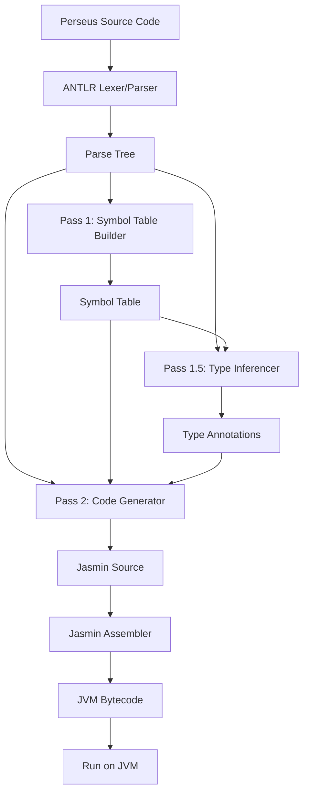
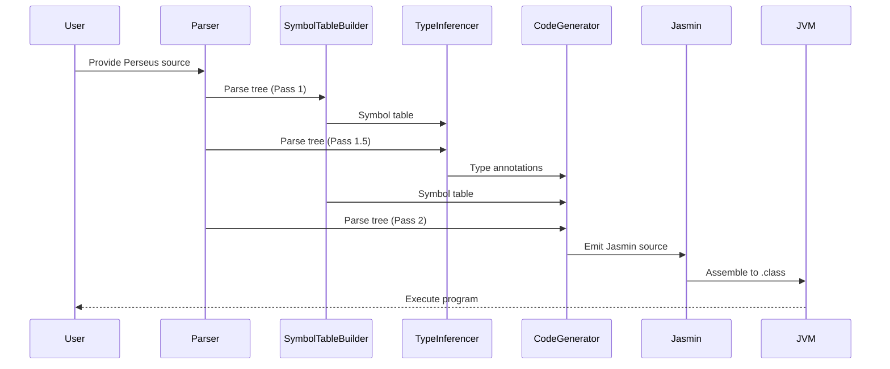
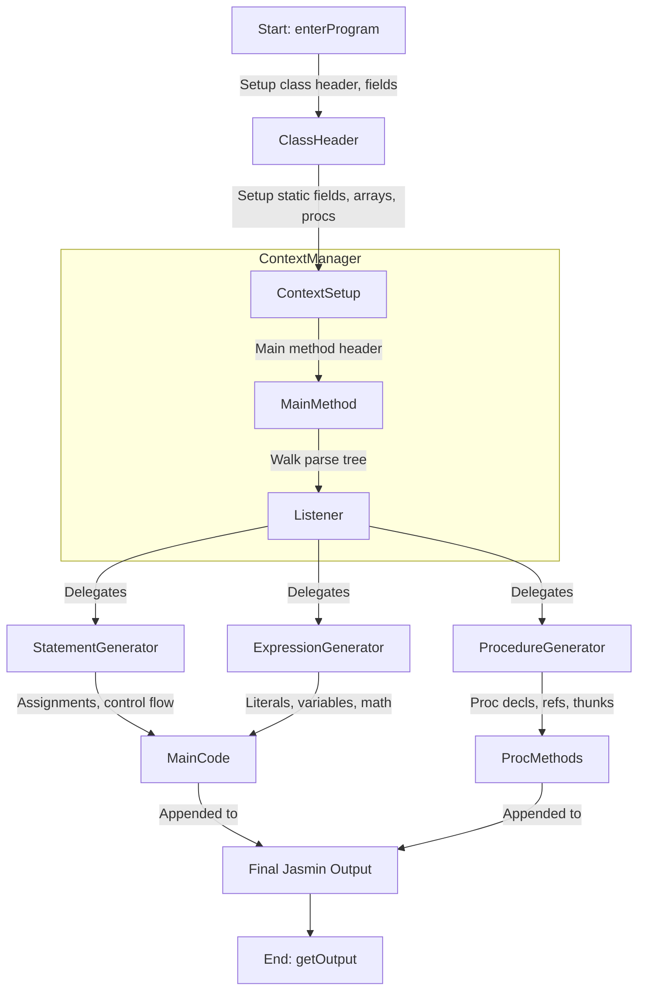

# Project Architecture

This document describes the high-level architecture of Perseus, an Algol-derived language and compiler platform targeting the JVM.

## Overview

The project consists of several main components:
- **Frontend (Parser & Lexer):** Parses Perseus source code using an ANTLR grammar rooted in the project's Algol heritage.
- **Pass 1 — Symbol Table Construction:** Walks the parse tree to collect variable names, types, and block scope nesting. Required before code generation because Jasmin needs `.limit locals N` declared before method body instructions, and forward `goto` labels must be known before jumps are emitted.
- **Pass 1.5 — Type Inference:** Walks the parse tree after symbol table construction to annotate every expression node with its resolved type (`integer`, `real`, `boolean`, `string`, or `procedure:T`). Required because `CodeGenerator` must select different JVM instructions depending on expression type (e.g. `iadd` vs `dadd`), and those types must be fully resolved before any code is emitted.
- **Pass 2 — Code Generation:** Walks the parse tree a third time, using both the symbol table from Pass 1 and the type annotations from Pass 1.5, to emit Jasmin assembly instructions.
- **Assembly:** Jasmin assembles the generated `.j` family into JVM `.class` files.
- **Post-Assembly Verification:** Tests can run `FixLimits` over the generated class family to recompute frames/max stack and catch verifier problems across the main class and its companions.
- **Testing & Samples:** Includes sample programs and JUnit tests for validation.
- **Supporting Tools:** Soot can be used standalone for bytecode analysis/disassembly but is not a build dependency.

## Development Approach

Perseus was not built by transliterating the full ALGOL reports directly into a finished ANTLR grammar in one step. In practice, that approach ran into the usual grammar-conversion problems, including left-recursion issues and hard-to-diagnose parse failures.

The project instead evolved iteratively:

- Start from small working programs
- Add the minimum grammar and code generation needed for each feature
- Expand coverage through tests and historically meaningful sample programs

That incremental approach remains part of the architecture story, because it explains why the grammar, tests, and implementation are so tightly coupled. Perseus grows by validating concrete language behavior, not just by broadening grammar coverage in the abstract.

## Tooling Choices

### Why ANTLR

ANTLR was chosen because Perseus is implemented in Java and benefits from a parser generator with strong Java integration, good documentation, and a practical developer experience. Other parser generators were considered, including CUP, but ANTLR fit the project better as the grammar evolved.

ANTLR also works well with the incremental development strategy above: the grammar can be extended feature by feature while keeping parsing, tests, and compiler passes aligned.

### Why Jasmin 2.4

Perseus uses **Jasmin 2.4** for JVM bytecode assembly. The project keeps `jasmin-2.4/jasmin.jar` bundled locally and references it directly from Gradle. This keeps the bytecode emission path explicit and stable, which is especially useful in a compiler that intentionally exposes and inspects its generated assembly.

Jasmin 3.x exists as a Maven artifact, but it is based on an older Jasmin lineage and is not the version used here.

### Why Soot Is Not a Build Dependency

Soot can still be useful as a standalone analysis or disassembly tool, but it is not a normal build dependency for Perseus. The main reason is dependency conflict: the Soot artifact pulls in a different Jasmin line transitively, which clashes with the project's deliberate use of Jasmin 2.4.

So the current approach is:

- Use Jasmin 2.4 directly for assembly
- Use ASM-based verification where needed in tests and post-processing
- Use Soot only as an optional external tool when deeper bytecode inspection is useful

## Component Diagram



## Data Flow



## Output Class Files

The compiler produces one or more `.class` files per source file:

- **`Hello.class`** — the main compiled class (always produced)
- **`Hello$Thunk0.class`, `Hello$Thunk1.class`, …** — synthetic thunk classes, one per call-by-name argument at each call site that uses a procedure with name-parameters
- **`Hello$ProcRef0.class`, `Hello$ProcRef1.class`, …** — synthetic procedure reference classes that lift a static method to an object implementing the appropriate procedure interface (`VoidProcedure`, `RealProcedure`, `IntegerProcedure`, or `StringProcedure`). One is generated per distinct procedure variable assignment or procedure-typed argument.

If the program needs call-by-name thunks or procedure references, `compileToFile()` also emits support Jasmin sources alongside the main program:

- `Thunk.j` is emitted when generated thunk classes are needed.
- `ProcedureInterfaces.j` is emitted when generated procedure-reference classes are needed.

- **`VoidProcedure.class`**, **`RealProcedure.class`**, **`IntegerProcedure.class`**, **`StringProcedure.class`** — interface classes assembled from `ProcedureInterfaces.j` and used as the type of procedure variables and procedure parameters. All `$ProcRef` classes implement one of these interfaces.
- **`Thunk.class`** — the interface class assembled from `Thunk.j` and used by call-by-name thunk objects (`get()` / `sync()` / `set()`).

In current builds, those support classes are emitted as Jasmin when needed (`Thunk.j` and `ProcedureInterfaces.j`) and assembled together with the main program and every `Main$*.j` companion. The emitted `Thunk` interface now includes `get()`, `sync()`, and `set()`, where `sync()` lets recursive procedure-identifier thunks refresh their captured bridged environment before re-entrant reuse.

This follows the same convention as `javac`, which emits `Foo$Inner.class` for inner classes and `Foo$1.class` for anonymous classes. Users run the program the same way regardless: `java -cp . Hello`. No JAR packaging is required.

---

## Array Model on the JVM

Perseus arrays are intentionally not Java arrays in the language-design sense, even though they are implemented on top of JVM array bytecodes.

### How Perseus differs from Java

- Perseus declarations use explicit bounds such as `real array q[-7:2];`, whereas Java uses lengths such as `double[] q = new double[10];`.
- Perseus subscripts are defined in terms of the declared lower and upper bounds, so `q[-7]` can be the first element of the array.
- Perseus multidimensional arrays are written with bound pairs in a single declaration, for example `integer array a[-1:0, 1:2];`, and accessed as `a[i, j]`.
- Java multidimensional arrays are arrays of arrays and are always indexed from zero.

### How Perseus lowers arrays

For ordinary declared arrays, Perseus currently lowers all arrays to a single JVM array whose element type matches the Perseus element type:

- `integer array` -> `int[]`
- `real array` -> `double[]`
- `boolean array` -> `boolean[]`
- `string array` -> `String[]`

Non-zero lower bounds are handled in generated code by subtracting the declared lower bound before each load or store. Multidimensional arrays are flattened to one JVM array in row-major order, with generated index arithmetic based on the declared extent of each dimension.

So a declaration like:

```algol
integer array a[-1:0, 1:2];
```

is treated as a four-element `int[]` on the JVM, while source-level accesses such as `a[-1, 1]` and `a[0, 2]` are translated into the corresponding zero-based linear offsets automatically.

### Why not use Java arrays-of-arrays

Java's nested-array model does not naturally match classic Algol semantics:

- lower bounds are always zero,
- the source syntax suggests separate nested arrays rather than one indexed matrix,
- and preserving Algol-style bound arithmetic would still require extra translation logic.

Flattening keeps the generated representation simple, deterministic, and close to the way classic numeric examples treat multidimensional arrays conceptually.

### Current limitation

Formal array parameters currently still use the existing one-dimensional passing convention: a JVM array reference plus hidden lower/upper bound integers. Multidimensional declared arrays are supported, but multidimensional formal array parameters are not yet lowered through that calling convention.

---

## Environmental Block Implementation

The Algol 60 Modified Report defines a fictitious outermost block called the **environmental block** that pre-declares all standard identifiers (I/O procedures, math functions, constants). Perseus implements this without generating any extra class files or runtime declarations. Instead, environmental identifiers are recognised **by name** in `CodeGenerator` and mapped directly to the appropriate JVM instruction sequences.

Recognition happens at two code-generation sites:

1. **`exitProcedureCall`** — for void-returning procedures used as statements:
   `outstring`, `outinteger`, `outreal`, `outchar`, `outterminator`, `outformat`, `stop`, `fault`,
   `openfile`, `openstring`, `closefile`

2. **`generateExpr`** — for value-returning function designators (expression position):
   `sqrt`, `abs`, `iabs`, `sign`, `entier`, `sin`, `cos`, `arctan`, `ln`, `exp`, `length`,
   `ininteger`, `inreal`, `informat`

3. **Variable name resolution** — for constants (no argument list):
   `maxreal`, `minreal`, `maxint`, `epsilon`

Environmental identifiers are **not** entered in `SymbolTableBuilder`'s symbol table, to avoid polluting user-visible scope or consuming JVM local-variable slots.

### Channel Resolution

The channel parameter (first argument of all I/O procedures) is a compile-time constant integer. Perseus resolves it at code-generation time:

| Channel | Target | Use |
|---|---|---|
| `0` | `System.err` | Standard error |
| `1` | `System.out` | Standard output |
| `2`+ | File or string buffer | Mapped at runtime via `openfile`/`openstring` |

Channels 0 and 1 are resolved statically because Jasmin `getstatic` targets are determined at compile time. Higher-numbered channels require a runtime dispatch table (a helper method or static array of streams), which is needed once file and string channel support is implemented.

If the channel argument is not a compile-time constant integer, codegen emits a warning comment and defaults to `System.out`.

### Math Functions

Math functions are mapped to `java/lang/Math` static methods via `invokestatic`. Constants (`maxreal`, `minreal`, `maxint`, `epsilon`) are inlined as `ldc`/`ldc2_w` instructions at their use sites. No `Math` object is created.

### Input Procedures

Input procedures (`ininteger`, `inreal`, `inchar`) read from `System.in` via a shared `Scanner` instance created once as a static field on the generated class, rather than constructed per call.

---

## Modular Code Generation Architecture (2026 Refactor)

As of March 2026, the code generation phase (Pass 2) has been refactored to use a modular, delegation-based architecture for maintainability and scalability:

- **CodeGenerator (Facade Listener):** Implements the main ANTLR listener and delegates code generation tasks to specialized generator classes.
- **ExpressionGenerator:** Handles all expression code generation, including literals, variables, arithmetic, and built-in math functions.
- **StatementGenerator:** Handles statement-level code generation, including assignments, control flow (`if`, `for`, `goto`), and procedure calls.
- **ProcedureGenerator:** Handles procedure declarations, procedure references (lifting static methods to objects), procedure variable calls, and thunk class generation for call-by-name parameters.
- **ContextManager:** Centralizes all shared state (symbol tables, local indices, output buffers, and synthetic class definitions for thunks and procedure references).
- **Synthetic Class Emission:** The compiler emits additional `.j` files for each required thunk class (call-by-name) and procedure reference class (procedure variables/parameters), following the convention `MainClass$ThunkN.j` and `MainClass$ProcRefN.j`.

This modular approach enables:
- Clean separation of concerns for each code generation domain
- Easier testing and extension of codegen logic
- Support for advanced Algol-family features (call-by-name, procedure variables, higher-order procedures)
- Deterministic and maintainable output structure

The overall data flow and output conventions remain as described above, but the code generation logic is now distributed across these specialized classes, coordinated by the `CodeGenerator` facade and the `ContextManager` state hub.

---

## CodeGenerator Modular Flow

The following diagram illustrates the modular delegation and output flow within the `CodeGenerator`:



---

## Architectural Issues and Test-Driven Debugging

Recent development has focused on the advanced call-by-name and nested-procedure cases that culminate in Knuth's Man-or-Boy test. The important architectural lessons are now worth documenting because they are easy to regress:

- **Static environment bridges are still part of the design.** Nested procedures currently communicate through generated static `__env_*` fields, and correctness depends on saving and restoring those bridge fields carefully at each procedure entry and exit.
- **Nested procedure self-thunks must be scoped per activation.** When a procedure contains nested procedures, codegen now saves, clears, and restores the nested `__selfThunk_*` fields so one activation cannot leak a recursive self-thunk object into another.
- **Recursive procedure-identifier actuals need a reusable but refreshable thunk.** For call-by-name procedure identifiers such as `B` inside Man-or-Boy, reusing the current thunk object is correct only if it is refreshed first. The generated `Thunk.sync()` hook exists specifically for that re-entrant refresh step.
- **Refreshing at the wrong time breaks semantics.** A key Man-or-Boy bug came from overwriting a thunk's captured bridged parameters at the end of `get()`. Re-entrant recursion can already have advanced that state, so the safe refresh point is before reuse (`sync()`), not after return from the recursive call.
- **Verifier coverage must include the whole generated family.** Problems can live in companion thunk/procedure-reference classes even when the main class verifies, so `FixLimits.fixClassFamilyInPlace()` now processes `Main.class` and every `Main$*.class`.
- **Conservative limits plus post-processing remain the current strategy.** The compiler still emits safe fixed limits such as `.limit stack 64` and `.limit locals 64`, and tests can then use ASM recomputation as a verification and cleanup pass.

For more detail on the debugging history, see:
- [docs/ManBoy-Debugging.md](ManBoy-Debugging.md)
- [docs/Compiler-TODO.md](Compiler-TODO.md)


## Compiling Perseus Source to Jasmin

To compile a Perseus source file to Jasmin assembly, the following steps are performed:

1. **Compile source to Jasmin**:
   Use the `PerseusCompiler.compileToFile` method to compile the source file into Jasmin output files. This method:
   - Parses the source file.
   - Generates the Jasmin assembly code.
   - Writes the main `.j` file to the specified directory.
   - Writes any generated `Main$ThunkN.j` and `Main$ProcRefN.j` companions.
   - Emits `Thunk.j` and/or `ProcedureInterfaces.j` when the program needs them.

   Example:
   ```java
   Path jasminFile = PerseusCompiler.compileToFile(
       "test/algol/hello.alg", "gnb/perseus/programs", "Hello", Paths.get("build/test-algol"));
   ```

2. **Assemble Jasmin to Class Files**:
   Use the `PerseusCompiler.assemble` method to convert the Jasmin `.j` file into a `.class` file. This method:
   - Assembles the main `.j` file.
   - Assembles every matching `Main$*.j` companion file.
   - Assembles `Thunk.j` and `ProcedureInterfaces.j` when present.

   Example:
   ```java
   PerseusCompiler.assemble(jasminFile, Paths.get("build/test-algol"));
   ```

3. **Optionally verify/fix the class family**:
   Tests can run `FixLimits.fixClassFamilyInPlace(...)` on the main generated class to recompute frames and max-stack values across the full generated class family.

4. **Run the Compiled Class**:
   Use a helper method (e.g., `runClass`) to execute the compiled `.class` file and capture its output.

   Example:
   ```java
   String output = runClass(Paths.get("build/test-algol"), "gnb.perseus.programs.Hello");
   ```

These steps are demonstrated in the unit tests, including the more demanding `manboy_test`, which now compiles, verifies, and runs Knuth's classic stress test successfully.

---

## Command-Line Interface (CLI)

The project includes a dedicated CLI, `PerseusCLI`, for compiling source files. The CLI wraps the `PerseusCompiler` and provides a user-friendly interface for compilation. Users can specify the input file, output directory, and class name directly from the command line.

Current parser/type diagnostic behavior and error-code conventions are documented in [Compiler Diagnostics.md](Compiler%20Diagnostics.md).

### Workflow with the CLI

1. **Input**: Provide the source file to the CLI.
2. **Compilation**: The CLI invokes the `PerseusCompiler` to parse the source file and generate the main Jasmin file plus any needed companion/support `.j` files.
3. **Assembly**: The Jasmin assembler converts that generated `.j` family into the corresponding `.class` files.
4. **Output**: The main program class and any required companion/support classes are ready to be executed on the JVM.

### Example Command

```bash
java -cp build/classes/java/main gnb.perseus.cli.PerseusCLI test/algol/hello.alg build/output Hello
```

This command compiles `hello.alg` into `Hello.j`, any needed companion `.j` files, and the assembled `.class` outputs in the `build/output` directory.

---

## Directory Structure

- `src/main/java/` - Java source code
- `src/main/antlr/` - ANTLR grammar files
- `src/test/java/` - Unit tests
- `test/algol/` - Sample source programs used for testing
- `jasmin-2.4/` - Jasmin 2.4 assembler (jar bundled with project; ANTLR managed via Gradle)
- `lib/` - Reserved for additional third-party libraries
- `docs/` - Documentation

## Future Extensions

- Support for more Perseus language features
- Improved error handling and diagnostics
- IDE integration (syntax highlighting, auto-completion)
- More advanced optimizations and analysis

---

_Last updated: March 24, 2026_

