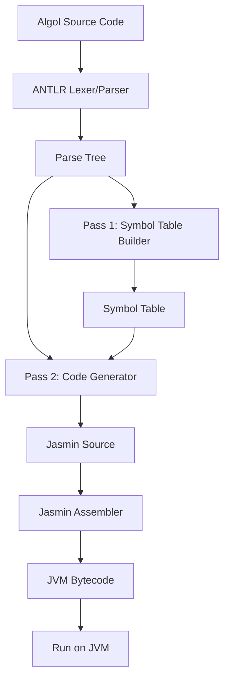
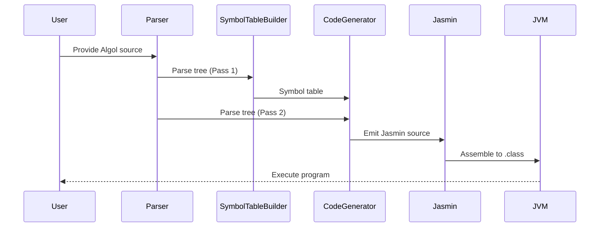

# Project Architecture

This document describes the high-level architecture of the Algol-to-JVM compiler project.

## Overview

The project consists of several main components:
- **Frontend (Parser & Lexer):** Parses Algol source code using ANTLR grammar.
- **Pass 1 — Symbol Table Construction:** Walks the parse tree to collect variable names, types, and block scope nesting. Required before code generation because Jasmin needs `.limit locals N` declared before method body instructions, and forward `goto` labels must be known before jumps are emitted.
- **Pass 2 — Code Generation:** Walks the parse tree a second time, using the symbol table from Pass 1, to emit Jasmin assembly instructions.
- **Assembly:** Jasmin assembles the `.j` output into JVM `.class` files.
- **Testing & Samples:** Includes sample Algol programs and JUnit tests for validation.
- **Supporting Tools:** Soot can be used standalone for bytecode analysis/disassembly but is not a build dependency (see [Development.md](Development.md)).

## Component Diagram



## Data Flow



## Output Class Files

The compiler produces one or more `.class` files per Algol source file:

- **`Hello.class`** — the main compiled class (always produced)
- **`Hello$Thunk0.class`, `Hello$Thunk1.class`, …** — synthetic thunk classes, one per call-by-name argument at each call site that uses a procedure with name-parameters

This follows the same convention as `javac`, which emits `Foo$Inner.class` for inner classes and `Foo$1.class` for anonymous classes. Users run the program the same way regardless: `java -cp . Hello`. No JAR packaging is required.

---

## Environmental Block Implementation

The Algol 60 Modified Report defines a fictitious outermost block called the **environmental block** that pre-declares all standard identifiers (I/O procedures, math functions, constants). JAlgol implements this without generating any extra class files or runtime declarations. Instead, environmental identifiers are recognised **by name** in `CodeGenerator` and mapped directly to the appropriate JVM instruction sequences.

Recognition happens at two code-generation sites:

1. **`exitProcedureCall`** — for void-returning procedures used as statements:
   `outstring`, `outinteger`, `outreal`, `outchar`, `outterminator`, `outformat`, `stop`, `fault`,
   `openfile`, `openstring`, `closefile`

2. **`generateExpr`** — for value-returning function designators (expression position):
   `sqrt`, `abs`, `iabs`, `sign`, `entier`, `sin`, `cos`, `arctan`, `ln`, `exp`, `length`,
   `ininteger`, `inreal`, `informat`

3. **Variable name resolution** — for constants (no argument list):
   `maxreal`, `minreal`, `maxint`, `epsilon`

Environmental identifiers are **not** entered in `SymbolTableBuilder`'s symbol table, to avoid polluting user-visible scope or consuming JVM local-variable slots.

### Channel Resolution

The channel parameter (first argument of all I/O procedures) is a compile-time constant integer. JAlgol resolves it at code-generation time:

| Channel | Target | Use |
|---|---|---|
| `0` | `System.err` | Standard error |
| `1` | `System.out` | Standard output |
| `2`+ | File or string buffer | Mapped at runtime via `openfile`/`openstring` |

Channels 0 and 1 are resolved statically because Jasmin `getstatic` targets are determined at compile time. Higher-numbered channels require a runtime dispatch table (a helper method or static array of streams), which is needed once file and string channel support is implemented.

If the channel argument is not a compile-time constant integer, codegen emits a warning comment and defaults to `System.out`.

### Math Functions

Math functions are mapped to `java/lang/Math` static methods via `invokestatic`. Constants (`maxreal`, `minreal`, `maxint`, `epsilon`) are inlined as `ldc`/`ldc2_w` instructions at their use sites. No `Math` object is created.

### Input Procedures

Input procedures (`ininteger`, `inreal`, `inchar`) read from `System.in` via a shared `Scanner` instance created once as a static field on the generated class, rather than constructed per call.

---

## Compiling Algol to Jasmin

To compile an Algol source file to Jasmin assembly, the following steps are performed:

1. **Compile Algol to Jasmin**:
   Use the `AntlrAlgolListener.compileToFile` method to compile the Algol source file into a Jasmin `.j` file. This method:
   - Parses the Algol source file.
   - Generates the Jasmin assembly code.
   - Writes the output to the specified directory.

   Example:
   ```java
   Path jasminFile = AntlrAlgolListener.compileToFile(
       "test/algol/hello.alg", "gnb/jalgol/programs", "Hello", Paths.get("build/test-algol"));
   ```

2. **Assemble Jasmin to Class Files**:
   Use the `AntlrAlgolListener.assemble` method to convert the Jasmin `.j` file into a `.class` file. This method:
   - Assembles the main `.j` file.
   - Assembles any companion files (e.g., Thunk classes or procedure reference classes).

   Example:
   ```java
   AntlrAlgolListener.assemble(jasminFile, Paths.get("build/test-algol"));
   ```

3. **Run the Compiled Class**:
   Use a helper method (e.g., `runClass`) to execute the compiled `.class` file and capture its output.

   Example:
   ```java
   String output = runClass(Paths.get("build/test-algol"), "gnb.jalgol.programs.Hello");
   ```

These steps are demonstrated in the unit tests, such as `AntlrAlgolListenerTest.hello()`.

---

## Directory Structure

- `src/main/java/` - Java source code
- `src/main/antlr/` - ANTLR grammar files
- `src/test/java/` - Unit tests
- `test/algol/` - Sample Algol programs used for testing
- `jasmin-2.4/` - Jasmin 2.4 assembler (jar bundled with project; ANTLR managed via Gradle)
- `lib/` - Reserved for additional third-party libraries
- `docs/` - Documentation

## Future Extensions

- Support for more Algol features
- Improved error handling and diagnostics
- IDE integration (syntax highlighting, auto-completion)
- More advanced optimizations and analysis

---

_Last updated: March 1, 2026_
