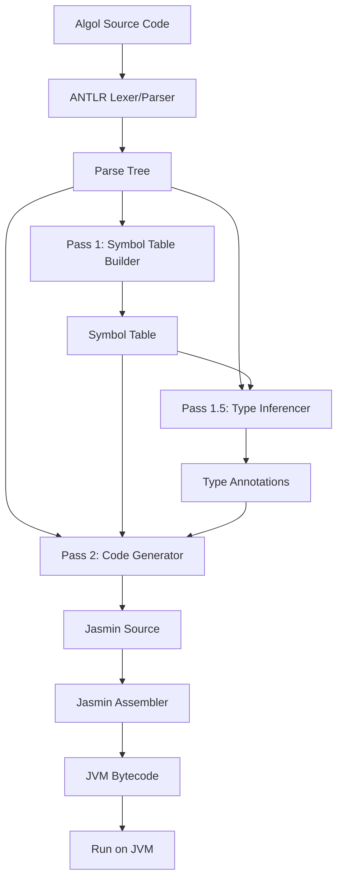
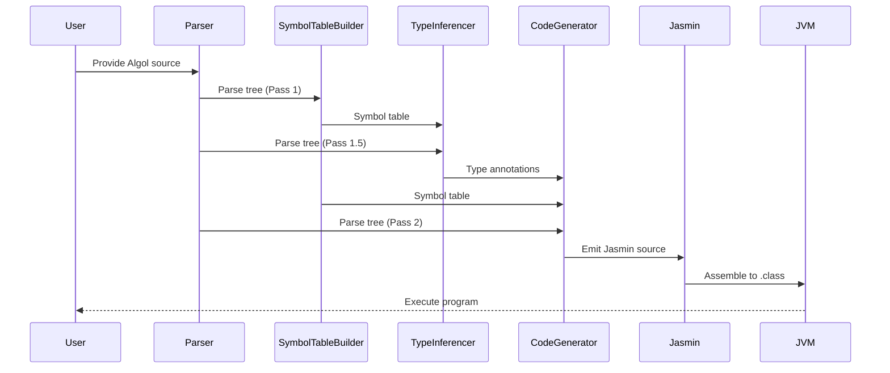

# Project Architecture

This document describes the high-level architecture of the Algol-to-JVM compiler project.

## Overview

The project consists of several main components:
- **Frontend (Parser & Lexer):** Parses Algol source code using ANTLR grammar.
- **Pass 1 — Symbol Table Construction:** Walks the parse tree to collect variable names, types, and block scope nesting. Required before code generation because Jasmin needs `.limit locals N` declared before method body instructions, and forward `goto` labels must be known before jumps are emitted.
- **Pass 1.5 — Type Inference:** Walks the parse tree after symbol table construction to annotate every expression node with its resolved type (`integer`, `real`, `boolean`, `string`, or `procedure:T`). Required because `CodeGenerator` must select different JVM instructions depending on expression type (e.g. `iadd` vs `dadd`), and those types must be fully resolved before any code is emitted.
- **Pass 2 — Code Generation:** Walks the parse tree a third time, using both the symbol table from Pass 1 and the type annotations from Pass 1.5, to emit Jasmin assembly instructions.
- **Assembly:** Jasmin assembles the `.j` output into JVM `.class` files.
- **Testing & Samples:** Includes sample Algol programs and JUnit tests for validation.
- **Supporting Tools:** Soot can be used standalone for bytecode analysis/disassembly but is not a build dependency (see [Development.md](Development.md)).

## Component Diagram



## Data Flow



## Output Class Files

The compiler produces one or more `.class` files per Algol source file:

- **`Hello.class`** — the main compiled class (always produced)
- **`Hello$Thunk0.class`, `Hello$Thunk1.class`, …** — synthetic thunk classes, one per call-by-name argument at each call site that uses a procedure with name-parameters
- **`Hello$ProcRef0.class`, `Hello$ProcRef1.class`, …** — synthetic procedure reference classes that lift a static method to an object implementing the appropriate procedure interface (`VoidProcedure`, `RealProcedure`, `IntegerProcedure`, or `StringProcedure`). One is generated per distinct procedure variable assignment or procedure-typed argument.

In addition, the following pre-compiled runtime support files are copied into the output directory alongside the program's `.class` files:

- **`VoidProcedure.class`**, **`RealProcedure.class`**, **`IntegerProcedure.class`**, **`StringProcedure.class`** — Java interfaces used as the type of procedure variables and procedure parameters. All `$ProcRef` classes implement one of these interfaces.
- **`Thunk.class`** — the interface used by call-by-name thunk objects (`get()` / `set()`).

This follows the same convention as `javac`, which emits `Foo$Inner.class` for inner classes and `Foo$1.class` for anonymous classes. Users run the program the same way regardless: `java -cp . Hello`. No JAR packaging is required.

---

## Environmental Block Implementation

The Algol 60 Modified Report defines a fictitious outermost block called the **environmental block** that pre-declares all standard identifiers (I/O procedures, math functions, constants). JAlgol implements this without generating any extra class files or runtime declarations. Instead, environmental identifiers are recognised **by name** in `CodeGenerator` and mapped directly to the appropriate JVM instruction sequences.

Recognition happens at two code-generation sites:

1. **`exitProcedureCall`** — for void-returning procedures used as statements:
   `outstring`, `outinteger`, `outreal`, `outchar`, `outterminator`, `outformat`, `stop`, `fault`,
   `openfile`, `openstring`, `closefile`

2. **`generateExpr`** — for value-returning function designators (expression position):
   `sqrt`, `abs`, `iabs`, `sign`, `entier`, `sin`, `cos`, `arctan`, `ln`, `exp`, `length`,
   `ininteger`, `inreal`, `informat`

3. **Variable name resolution** — for constants (no argument list):
   `maxreal`, `minreal`, `maxint`, `epsilon`

Environmental identifiers are **not** entered in `SymbolTableBuilder`'s symbol table, to avoid polluting user-visible scope or consuming JVM local-variable slots.

### Channel Resolution

The channel parameter (first argument of all I/O procedures) is a compile-time constant integer. JAlgol resolves it at code-generation time:

| Channel | Target | Use |
|---|---|---|
| `0` | `System.err` | Standard error |
| `1` | `System.out` | Standard output |
| `2`+ | File or string buffer | Mapped at runtime via `openfile`/`openstring` |

Channels 0 and 1 are resolved statically because Jasmin `getstatic` targets are determined at compile time. Higher-numbered channels require a runtime dispatch table (a helper method or static array of streams), which is needed once file and string channel support is implemented.

If the channel argument is not a compile-time constant integer, codegen emits a warning comment and defaults to `System.out`.

### Math Functions

Math functions are mapped to `java/lang/Math` static methods via `invokestatic`. Constants (`maxreal`, `minreal`, `maxint`, `epsilon`) are inlined as `ldc`/`ldc2_w` instructions at their use sites. No `Math` object is created.

### Input Procedures

Input procedures (`ininteger`, `inreal`, `inchar`) read from `System.in` via a shared `Scanner` instance created once as a static field on the generated class, rather than constructed per call.

---

## Modular Code Generation Architecture (2026 Refactor)

As of March 2026, the code generation phase (Pass 2) has been refactored to use a modular, delegation-based architecture for maintainability and scalability:

- **CodeGenerator (Facade Listener):** Implements the main ANTLR listener and delegates code generation tasks to specialized generator classes.
- **ExpressionGenerator:** Handles all expression code generation, including literals, variables, arithmetic, and built-in math functions.
- **StatementGenerator:** Handles statement-level code generation, including assignments, control flow (`if`, `for`, `goto`), and procedure calls.
- **ProcedureGenerator:** Handles procedure declarations, procedure references (lifting static methods to objects), procedure variable calls, and thunk class generation for call-by-name parameters.
- **ContextManager:** Centralizes all shared state (symbol tables, local indices, output buffers, and synthetic class definitions for thunks and procedure references).
- **Synthetic Class Emission:** The compiler emits additional `.j` files for each required thunk class (call-by-name) and procedure reference class (procedure variables/parameters), following the convention `MainClass$ThunkN.j` and `MainClass$ProcRefN.j`.

This modular approach enables:
- Clean separation of concerns for each code generation domain
- Easier testing and extension of codegen logic
- Support for advanced Algol features (call-by-name, procedure variables, higher-order procedures)
- Deterministic and maintainable output structure

The overall data flow and output conventions remain as described above, but the code generation logic is now distributed across these specialized classes, coordinated by the `CodeGenerator` facade and the `ContextManager` state hub.

---

## Compiling Algol to Jasmin

To compile an Algol source file to Jasmin assembly, the following steps are performed:

1. **Compile Algol to Jasmin**:
   Use the `AntlrAlgolListener.compileToFile` method to compile the Algol source file into a Jasmin `.j` file. This method:
   - Parses the Algol source file.
   - Generates the Jasmin assembly code.
   - Writes the output to the specified directory.

   Example:
   ```java
   Path jasminFile = AntlrAlgolListener.compileToFile(
       "test/algol/hello.alg", "gnb/jalgol/programs", "Hello", Paths.get("build/test-algol"));
   ```

2. **Assemble Jasmin to Class Files**:
   Use the `AntlrAlgolListener.assemble` method to convert the Jasmin `.j` file into a `.class` file. This method:
   - Assembles the main `.j` file.
   - Assembles any companion files (e.g., Thunk classes or procedure reference classes).

   Example:
   ```java
   AntlrAlgolListener.assemble(jasminFile, Paths.get("build/test-algol"));
   ```

3. **Run the Compiled Class**:
   Use a helper method (e.g., `runClass`) to execute the compiled `.class` file and capture its output.

   Example:
   ```java
   String output = runClass(Paths.get("build/test-algol"), "gnb.jalgol.programs.Hello");
   ```

These steps are demonstrated in the unit tests, such as `AntlrAlgolListenerTest.hello()`.

---

## Command-Line Interface (CLI)

The project includes a dedicated CLI, `JAlgolCLI`, for compiling Algol source files. The CLI wraps the `AntlrAlgolListener` and provides a user-friendly interface for compilation. Users can specify the input file, output directory, and class name directly from the command line.

### Workflow with the CLI

1. **Input**: Provide the Algol source file to the CLI.
2. **Compilation**: The CLI invokes the `AntlrAlgolListener` to parse the source file and generate Jasmin assembly.
3. **Assembly**: The Jasmin assembler converts the `.j` file into a `.class` file.
4. **Output**: The `.class` file is ready to be executed on the JVM.

### Example Command

```bash
java -cp build/classes/java/main gnb.jalgol.cli.JAlgolCLI test/algol/hello.alg build/output Hello
```

This command compiles `hello.alg` into `Hello.j` and `Hello.class` in the `build/output` directory.

---

## Directory Structure

- `src/main/java/` - Java source code
- `src/main/antlr/` - ANTLR grammar files
- `src/test/java/` - Unit tests
- `test/algol/` - Sample Algol programs used for testing
- `jasmin-2.4/` - Jasmin 2.4 assembler (jar bundled with project; ANTLR managed via Gradle)
- `lib/` - Reserved for additional third-party libraries
- `docs/` - Documentation

## Future Extensions

- Support for more Algol features
- Improved error handling and diagnostics
- IDE integration (syntax highlighting, auto-completion)
- More advanced optimizations and analysis

---

_Last updated: March 10, 2026_
