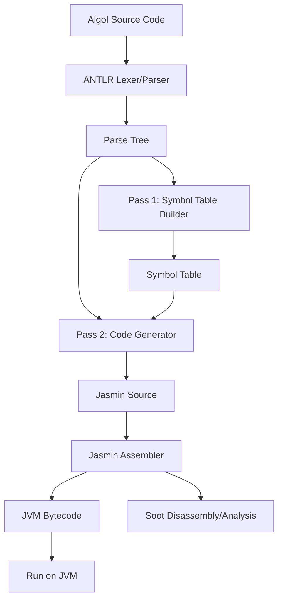
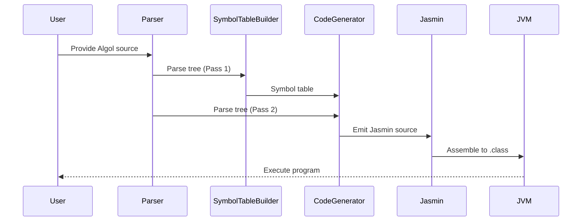

# Project Architecture

This document describes the high-level architecture of the Algol-to-JVM compiler project.

## Overview

The project consists of several main components:
- **Frontend (Parser & Lexer):** Parses Algol source code using ANTLR grammar.
- **Pass 1 — Symbol Table Construction:** Walks the parse tree to collect variable names, types, and block scope nesting. Required before code generation because Jasmin needs `.limit locals N` declared before method body instructions, and forward `goto` labels must be known before jumps are emitted.
- **Pass 2 — Code Generation:** Walks the parse tree a second time, using the symbol table from Pass 1, to emit Jasmin assembly instructions.
- **Assembly:** Jasmin assembles the `.j` output into JVM `.class` files.
- **Testing & Samples:** Includes sample Algol programs and JUnit tests for validation.
- **Supporting Tools:** Uses Soot for bytecode analysis/disassembly.

## Component Diagram

## Data Flow

## Directory Structure

- `src/main/java/` - Java source code
- `src/main/antlr/` - ANTLR grammar files
- `src/test/java/` - Unit tests
- `test/algol/` - Sample Algol programs used for testing
- `lib/` - Third-party libraries (Jasmin; ANTLR and Soot managed via Gradle)
- `docs/` - Documentation

## Future Extensions

- Support for more Algol features
- Improved error handling and diagnostics
- IDE integration (syntax highlighting, auto-completion)
- More advanced optimizations and analysis

---

_Last updated: February 28, 2026_
